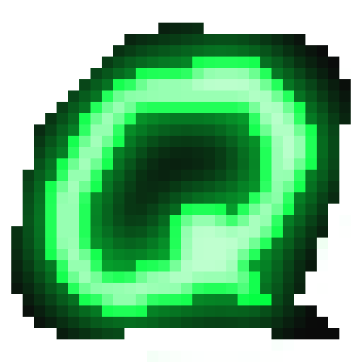

<h1> Quark</h1>

**A keyboard-driven, terminal-aesthetic Matrix client.**

  

Quark is a [Matrix](https://matrix.org) chat client that looks like a terminal but renders in a real GUI window. You drive it with vim-style keys and a `:` command bar, while still getting inline images, animated GIFs, custom emoji, and stickers — things a true TUI can't render reliably.

> **Why a GUI and not a real TUI?** Custom emoji (``) and stickers need to render as images inline with text. Terminal image protocols (Sixel/Kitty) can't do that dependably across terminals, so the CLI look is achieved purely with CSS (monospace fonts, dark background, prompt-style input) inside a lightweight Tauri webview.

---

## Features

- **End-to-end encryption** — Megolm via Vodozemac, cross-signing, and device verification (SAS emoji + QR).
- **Messaging** — rich replies, threads, reactions (Unicode *and* custom emoji), message editing & redaction, typing indicators, read receipts (public + private), and presence.
- **Custom emoji & stickers** — MSC2545 (`im.ponies`) packs from rooms and your account data, compatible with Cinny, FluffyChat, Nheko, and SchildiChat. Type `:shortcode:` for inline autocomplete with image previews.
- **GIF search** — integrated Tenor / Giphy / Klipy search; selected GIFs are uploaded to your homeserver (not hot-linked) and sent as `m.image`.
- **Media** — authenticated media (MSC3916), inline image and `m.video` playback, blurhash placeholders, disk-backed LRU cache.
- **Spaces** — Cinny-style icon strip + text-only room list in a stable, non-jumpy order.
- **Room directory** — `:directory` opens a searchable public-room browser with `j/k` navigation.
- **Theming** — TOML themes with 11 built-ins, switchable live via `:theme` or Settings.
- **Vim everything** — Normal / Insert / Command / Visual modes; every binding is remappable via a vimrc-style `quarkrc`.

**Currently password login only.** OIDC (via MAS) and SSO are planned. Other in-progress items — theme filesystem hot-reload, key backup (SSSS), emoji/sticker pack management UI, and mobile (iOS/Android) builds — are tracked in [DESIGN.md](DESIGN.md).

---

## Architecture

```
┌─────────────────────────────────────┐
│        Web Frontend (TypeScript)    │
│   Monospace / terminal-styled UI    │
│   Renders HTML, images, emoji       │
├─────────────────────────────────────┤
│          Tauri v2 IPC Bridge        │
├─────────────────────────────────────┤
│         Rust Backend (Core)         │
│   matrix-sdk  ·  Vodozemac E2EE     │
│   Sliding Sync  ·  Media cache      │
└─────────────────────────────────────┘
```

- **Frontend** — vanilla TypeScript with direct DOM manipulation (no React/Vue) to keep the terminal feel without framework overhead. Built with Vite, tested with Vitest.
- **Backend** — Rust with [`matrix-sdk`](https://github.com/matrix-org/matrix-rust-sdk) 0.9 (the same SDK behind Element X), handling protocol, sync, E2EE, and media. Bundled by Tauri v2 — roughly 10× smaller binary and far less RAM than Electron.

See [DESIGN.md](DESIGN.md) for the authoritative spec and [CLAUDE.md](CLAUDE.md) for the contributor-oriented architecture overview.

---

## Getting started

### Prerequisites

- A Rust toolchain (stable, ≥ 1.78)
- Node.js + [pnpm](https://pnpm.io) (`packageManager: pnpm@10.x`)
- Tauri v2 [system dependencies](https://v2.tauri.app/start/prerequisites/) for your OS (WebKitGTK, etc. on Linux)

A [Nix flake](flake.nix) is provided — `direnv allow` (or `nix develop`) drops you into a shell with everything installed.

### Install with Nix

The flake also builds Quark as a package (Linux):

```bash
nix run github:mcplummet/quark    # try it without installing
nix profile install github:mcplummet/quark
```

Or consume it declaratively from a NixOS / home-manager flake:

```nix
{
  inputs.quark = {
    url = "github:mcplummet/quark";
    inputs.nixpkgs.follows = "nixpkgs"; # optional, builds against your nixpkgs
  };

  # then either add the package directly…
  environment.systemPackages = [ inputs.quark.packages.${pkgs.system}.default ];

  # …or use the overlay and refer to pkgs.quark
  nixpkgs.overlays = [ inputs.quark.overlays.default ];
}
```

### Run it

```bash
pnpm install

pnpm tauri dev    # full app: Rust backend + frontend, hot-reload
pnpm dev          # frontend only, mock IPC, no Rust process (port 1450)

pnpm build        # tsc + vite build → dist/
pnpm test         # Vitest (single run)
pnpm test:watch   # Vitest (watch mode)
pnpm tauri build  # release bundle (.deb / .AppImage / .rpm / .msi / .dmg / …)
```

Backend-only work, from `src-tauri/`:

```bash
cargo build
cargo test
```

---

## Configuration

Config lives in `~/.config/quark/`:

| File          | Purpose                                              |
|---------------|------------------------------------------------------|
| `config.toml` | General settings (theme, sync, media, GIF, emoji)    |
| `quarkrc`     | Vim-style keybindings & options (vimrc-inspired)     |
| `themes/`     | Your custom theme `.toml` files                      |

`config.toml`:

```toml
[general]
theme = "phosphor"
notifications = true
confirm_redact = true

[sync]
timeline_limit = 50

[media]
auto_load_images = true
cache_size_mb = 500

[gif]
provider = "tenor"   # tenor | giphy | klipy
api_key = ""         # bring your own
rating = "pg"        # g | pg | pg-13 | r
```

`quarkrc` (keybindings use vimrc syntax; sourced on startup and on `:source`):

```vim
" remap navigation, vim-style
nmap gg  jump-top
nmap G   jump-bottom
nmap dd  redact

" leader bindings (leader defaults to space)
let mapleader = " "
nmap <leader>e  emoji-picker
nmap <leader>g  gif-search

set scrolloff=5
set gif_provider=tenor
```

Full keybinding command list, scoped maps (`tmap`/`rmap`/`pmap`), `autocmd`, and the complete theme schema are documented in [DESIGN.md](DESIGN.md).

---

## Keybindings (defaults)

All bindings are rebindable in `quarkrc`.

| Context     | Key       | Action                    |
|-------------|-----------|---------------------------|
| Global      | `i`       | Enter insert mode         |
| Global      | `Esc`     | Return to normal mode     |
| Global      | `:`       | Open command bar          |
| Room list   | `j` / `k` | Move down / up            |
| Room list   | `Enter`   | Open room                 |
| Room list   | `/`       | Search / filter rooms     |
| Timeline    | `j` / `k` | Scroll down / up          |
| Timeline    | `g` / `G` | Jump to top / bottom      |
| Timeline    | `r`       | Reply to selected message |
| Timeline    | `e`       | React                     |
| Timeline    | `t`       | Open / enter thread       |
| Timeline    | `dd`      | Redact own message        |
| Insert      | `Ctrl-e`  | Emoji / sticker picker    |
| Insert      | `Ctrl-g`  | GIF search                |
| Insert      | `Tab`     | Autocomplete `:shortcode:`|

Common commands: `:join`, `:leave`, `:invite`, `:verify`, `:theme`, `:gif`, `:directory`, `:roomsettings`, `:debug`, `:version`.

---

## Themes

Eleven built-in themes ship in [themes/](themes/):

`phosphor` (green CRT) · `amber` (amber CRT) · `dracula` · `nord` · `solarized-dark` · `solarized-light` · `catppuccin-mocha` · `catppuccin-latte` · `gruvbox-dark` · `high-contrast` · `pesterchum`

Switch with `:theme <name>` or via Settings. (Filesystem hot-reload on save is not yet wired up — switching applies immediately, but editing a theme file currently needs a `:theme` re-select.)

---

## Project structure

```
quark/
├── src/                  # TypeScript frontend
│   ├── main.ts           # bootstrap, login, sync startup
│   ├── app/              # actions (IPC dispatch), state, keyboard, sync
│   ├── ipc/              # Tauri invoke wrappers, shared types, mock layer
│   ├── ui/               # DOM components (Timeline, Input, RoomList, pickers…)
│   ├── vim/              # mode state machine, keymaps, : command parser
│   ├── theme/            # CSS custom-property loader
│   └── style/            # monospace terminal base CSS
├── src-tauri/            # Rust backend
│   └── src/
│       ├── lib.rs        # Tauri builder, managed state, plugins
│       ├── commands.rs   # #[tauri::command] IPC handlers
│       ├── matrix/       # client, timeline, rooms, crypto, emoji, media…
│       ├── gif/          # Tenor / Giphy / Klipy clients
│       ├── config/       # TOML theme + quarkrc parsers
│       ├── media_cache.rs
│       └── notifications.rs
├── themes/               # built-in theme TOMLs
├── flatpak/              # flatpak manifest + desktop/metainfo
├── DESIGN.md             # authoritative spec
└── CLAUDE.md             # architecture notes for contributors
```

---

## Building & releases

Multi-platform bundles are produced by [GitHub Actions](.github/workflows/release.yml) on tagged (`v*`) releases: Linux (`.deb` / `.AppImage` / `.rpm`), Flatpak, Windows (`.exe` / `.msi`), macOS (`.dmg`), and Android (`.apk`). A Flatpak manifest lives under [flatpak/](flatpak/) (app ID `tel.quark.app`).

Mobile (iOS and Android, via Tauri v2) is **experimental and in progress** — see the mobile sections of [DESIGN.md](DESIGN.md).

---

## Contributing

- When shipping a feature or fix, bump the version in **all three** files together: `package.json`, `src-tauri/Cargo.toml`, and `src-tauri/tauri.conf.json`. Features bump minor; fixes bump patch.
- Keep [DESIGN.md](DESIGN.md) up to date — it's the authoritative spec.
- Run `pnpm test` and `cargo test` (from `src-tauri/`) before opening a pull request.

---

## License

Copyright (C) 2026 mcplummet.

Quark is licensed under the **GNU Affero General Public License v3.0**. See [LICENSE](LICENSE).
